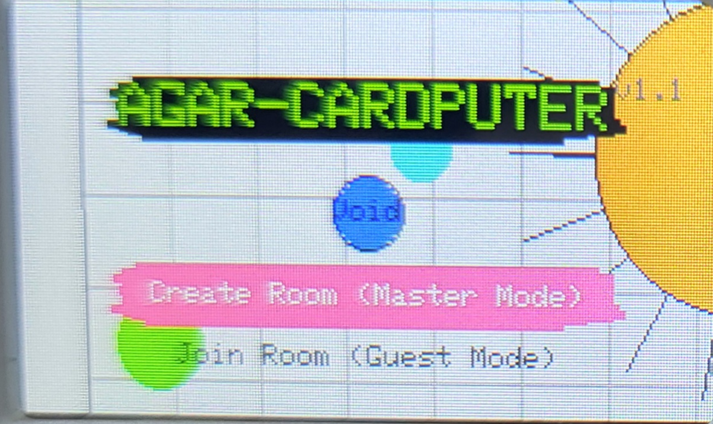

# Agar-Cardputer

[中文版](./README.md#中文版) | [English Version](./README.md#english-version)

---

## 中文版

### 简介
**Agar-Cardputer** 是一款专为 M5Cardputer 硬件深度定制的多人联机竞技游戏。基于原生 **ESP-NOW** 技术实现免路由低延迟通讯，让您与家人朋友即刻开启多设备同屏吞噬大战。

### 🚀 核心特色
- **零配置联机**：利用 ESP-NOW 黑科技，两台设备开机即可自动组网，无需 WiFi 路由器。
- **航位推算 (Dead Reckoning)**：内置高级位移预测算法，提供 20Hz 的丝滑物理手感，消除网络频闪。
- **末世资源模式**：全图固定 30,000 点总质量。随着资源耗尽，生存竞争将愈发激烈。
- **高精度判定**：基于极坐标投影的碰撞检测，小球可穿梭于刺球缝隙，大球擦边即炸。

### 🎮 操作指南
| 按键 | 功能 |
| :--- | :--- |
| **IMU/方向键** | 控制球体移动 |
| **ESC** | 切换排行榜显示/隐藏 |
| **`-` / `+` (Cardputer)** | 调节视野缩放 (0.1x - 1.3x) |
| **BtnA / BtnB (StickS3)** | 放大 / 缩小 视野 |

### 🛠 技术规格
- **刷新率**：上行 20Hz (输入) / 下行 12.5Hz (状态广播，预测补全至 20Hz)。
- **成长公式**：`Radius = 15 + sqrt(score) * 2.5` (面积与质量线性一致)。
- **协议載荷**：`StateMsg` (238 字节)，完美契合 ESP-NOW 250 字节上限。

---

## English Version

### Introduction
**Agar-Cardputer** is a high-performance local multiplayer competitive game tailored exclusively for the M5Cardputer hardware. Powered by native **ESP-NOW**, it enables instant, router-free, low-latency cross-device predation battles with your friends and family.

### 🚀 Key Features
- **Zero-Config Multiplayer**: Instant P2P networking via ESP-NOW. No WiFi router required.
- **Dead Reckoning**: Advanced movement prediction provides a silky-smooth 20Hz experience, eliminating network jitter.
- **End of Days Mode**: Hardcore resource management with a fixed 30,000 global mass pool.
- **Precision Collision**: High-fidelity detection allowing small players to use gaps in viruses for tactical escapes.

### 🎮 Control Guide
| Key | Function |
| :--- | :--- |
| **IMU / Arrows** | Move the cell |
| **ESC** | Toggle Leaderboard visibility |
| **`-` / `+` (Cardputer)** | Adjust View Zoom (0.1x - 1.3x) |
| **BtnA / BtnB (StickS3)** | Zoom In / Zoom Out |

### 🛠 Technical Specifications
- **Sync Rate**: 20Hz Upstream (Input) / 12.5Hz Downstream (State Broadcast, predicted to 20Hz).
- **Growth Model**: `Radius = 15 + sqrt(score) * 2.5` (Linear alignment of area and mass).
- **Payload**: `StateMsg` (238 Bytes), optimized for ESP-NOW's 250-byte limit.

---

### 📦 部署 (Deploy)
已发布至M5bunner

---
**Agar-Cardputer - 极致丝滑，末路称王。/ Dominate the arena with precision.**
